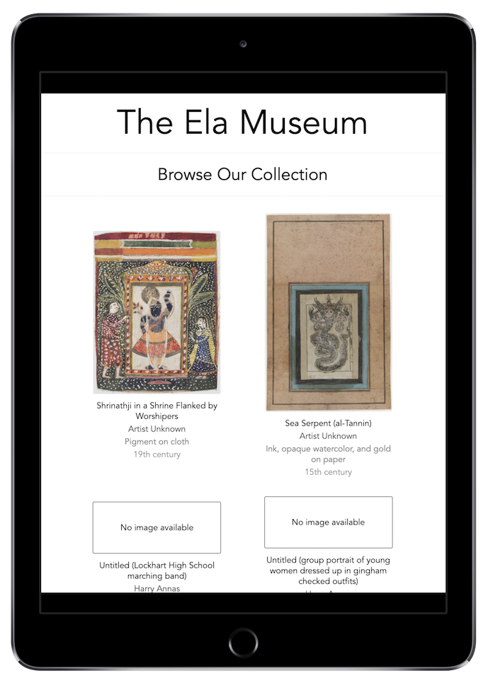
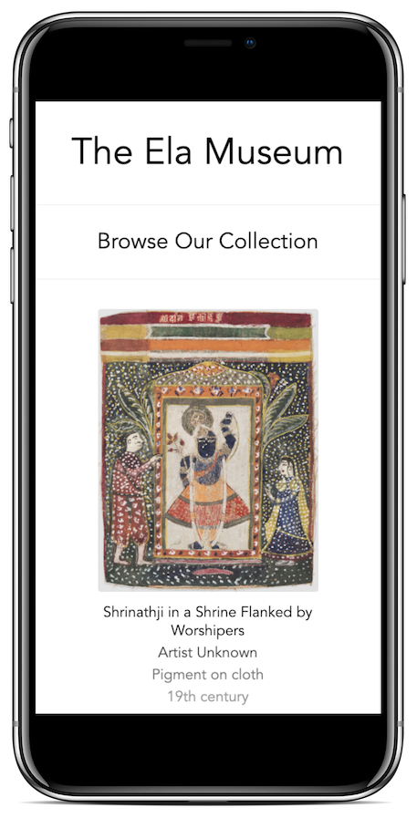

# The Ela Museum
The Ela Museum utilizes the Harvard Art Museums API to display a clean, straightforward example of a collection of textiles, works on paper, color and black/white photographs, and negatives.  It is primarily built using Vue.js and CSS3.

### Deployed Application
[The Ela Museum](https://jovial-shaw-0f147d.netlify.com/)

## Technologies Used:
- Vue.js
- CSS3
- Oursky

## Project Requirements:
Project spec can be found [here](http://frontend.turing.io/projects/final-countdown.html) and [here](https://gist.github.com/letakeane/16882c0604830c5482b25431a6a6cb19).

## Images:
### Desktop View

### Tablet View

### Mobile View

### Wireframe

